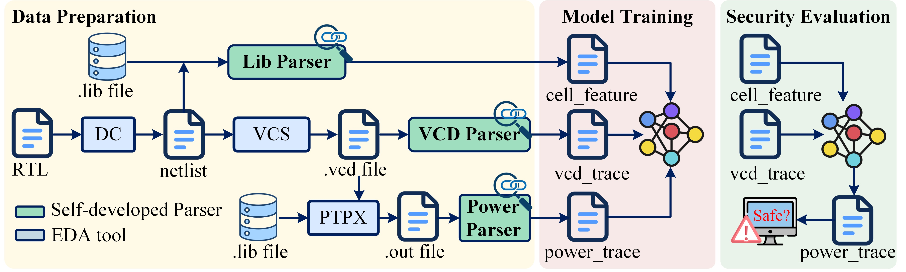

# AIPS
AI-based Power Simulation for Pre-silicon Side-channel Security Evaluation


- AIPS is designed to predict the power traces from ICs at the netlist level.
- Version 1.0


# Table of contents
- [Prerequisites](#prerequisites)
- [Running AIPS](#running-emsim)
    - [Data Preparation](#data-preparation)
    - [Model Training](#model-training)
    - [Security Evaluation](#security-evaluation)
- [Contributors](#contributors)
- [Copyright](#copyright)

# Prerequisites
At a minimum:

- Python 3.8+ with PIP
- VCS, PrimeTime PX
- Linux or Windows

# Running AIPS
AIPS consists of three main steps: data preparation, model training and security evaluation.

<table>
  <tr>
    <td  align="center"></td>
  </tr>
</table>

## Data Preparation

1. Synthesize RTL code into netlist using DC tools
2. Complete gate level VCS simulation and get .vcd file
3. complete the gate level PTPX power simulation and get the .out file
```
frontdata:
design.v                  # gate-level netlist in Verilog
design.lib                # technology process node file
design.vcd                # signal switching activities from VCS
design.out                # power data from PTPX
```
4. Parsing the .v file, .lib file, .vcd file and .out file in turn to obtain the inputs to the Diffusion model
```
topology-analysis.py
optional arguments:
  [ --input ]                      path to the netlist file, should end in .v
  [ --result_folder ]              path to the output files
  [ --output_pins ]                output pin names of device
```

```
Lib_parser.py
optional arguments:
  [ --lib_file ]                   path to the lib file, should end in .lib
  [ --cell_power_pkl ]             path to the output files
```

```
cell_feature.py
optional arguments:
  [ --cell2pin_pkl ]               path to the input file, cell2pin.pkl
  [ --cell_power_pkl ]             path to the input file, cell_power.pkl
  [ --cell_power_pkl ]             path to the output file, cell_feature.npy
```

```
VCD_parser.py
optional arguments:
  [ --cell2pin_pkl ]               path to the input file, cell2pin.pkl
  [ --cell_power_pkl ]             path to the input file, cell_power.pkl
  [ --cell_power_pkl ]             path to the output file, cell_feature.npy
```

```
Out_parser.py
optional arguments:
  [ --cell2pin_pkl ]               path to the input file, cell2pin.pkl
  [ --cell_power_pkl ]             path to the input file, cell_power.pkl
  [ --cell_power_pkl ]             path to the output file, cell_feature.npy
```

## Model Training

Diffusion model for predicting power trace.

```
Diffusion_model.py
optional arguments:
  [ --mode ]                       Choosing between 'train' and 'predict'
  [ --feature_path ]               path to the input file for training and prediction, cell_feature.npy
  [ --power_path ]                 path to the input file for training, real power traces generated by PTPS, power_trace_train.npy
  [ --train_vcd_path ]             path to the input file for training, signal switching activities parsed from .vcd file, pin_switch_mean_160_train.npy
  [ --predict_vcd_path ]           path to the input file for prediction, signal switching activities parsed from .vcd file, pin_switch_mean_160_test.npy
  [ --output_path ]                path to the output file for prediction, predicted power traces, power_trace_train_pre.npy
```

## Security Evaluation

Using side-channel analysis algorithms to analyze the predicted power trace to determine whether the chip has security risks.


# Copyright

It is mainly intended for non-commercial use, such as academic research.

# Citation

If you utilize AIPS in your research, we kindly request citation of the respective publication: 

```
@ARTICLE{
  author={ },
  journal={ }, 
  title={ }, 
  year={ },
  volume={ },
  number={},
  pages={ },
  keywords={ },
  doi={ }}
```


